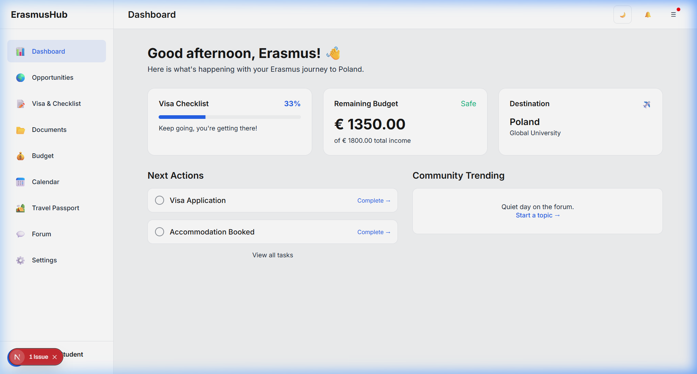
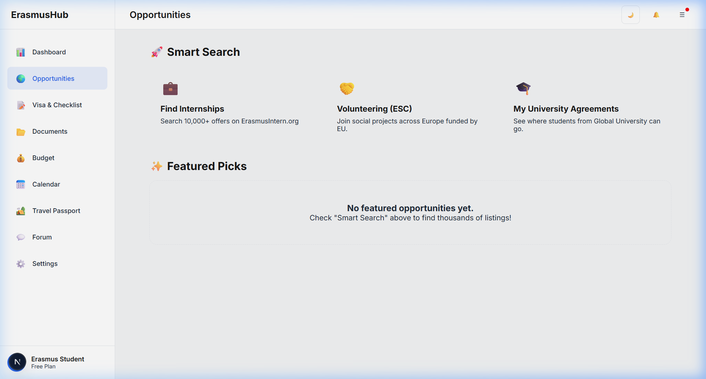
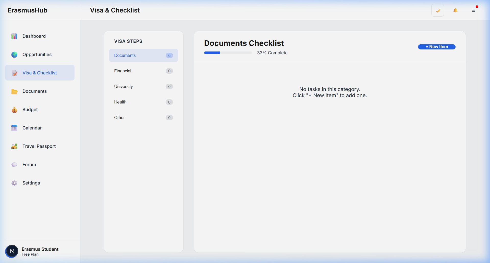
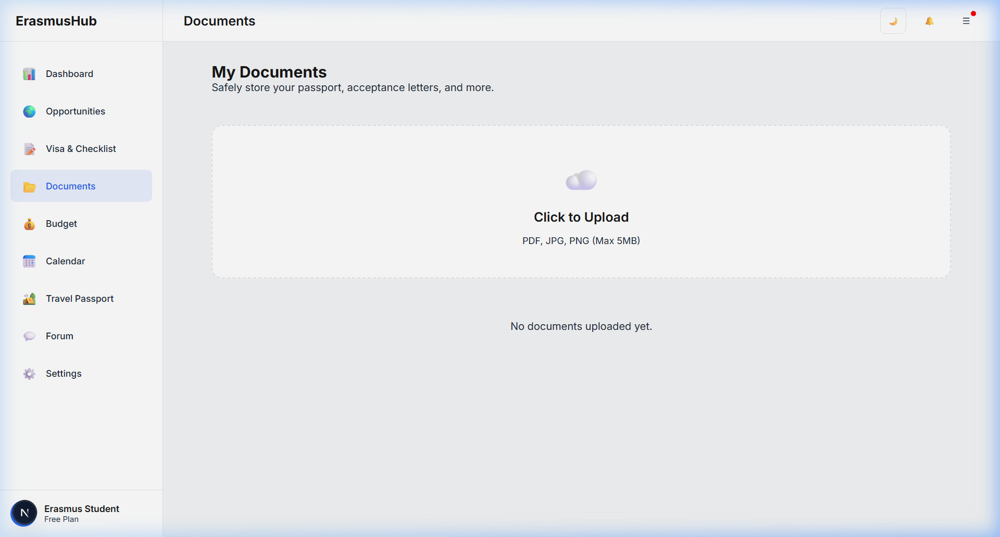
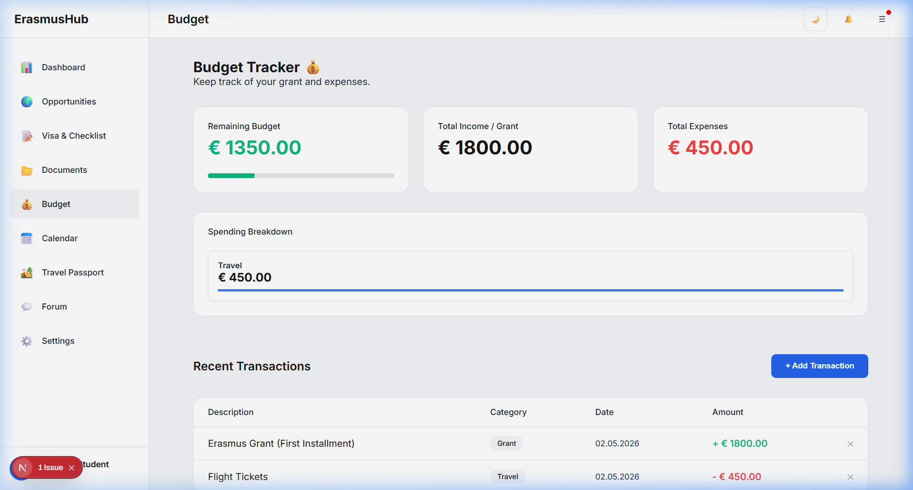
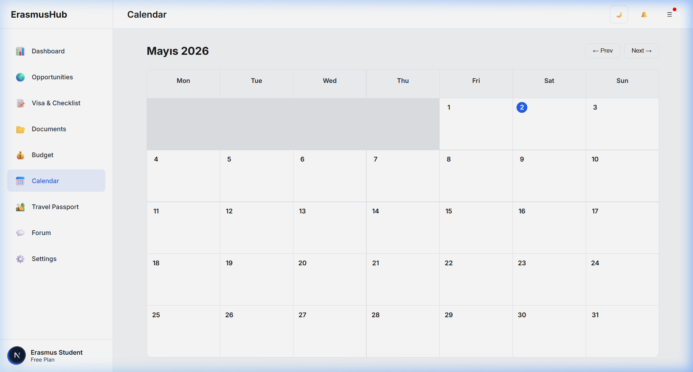
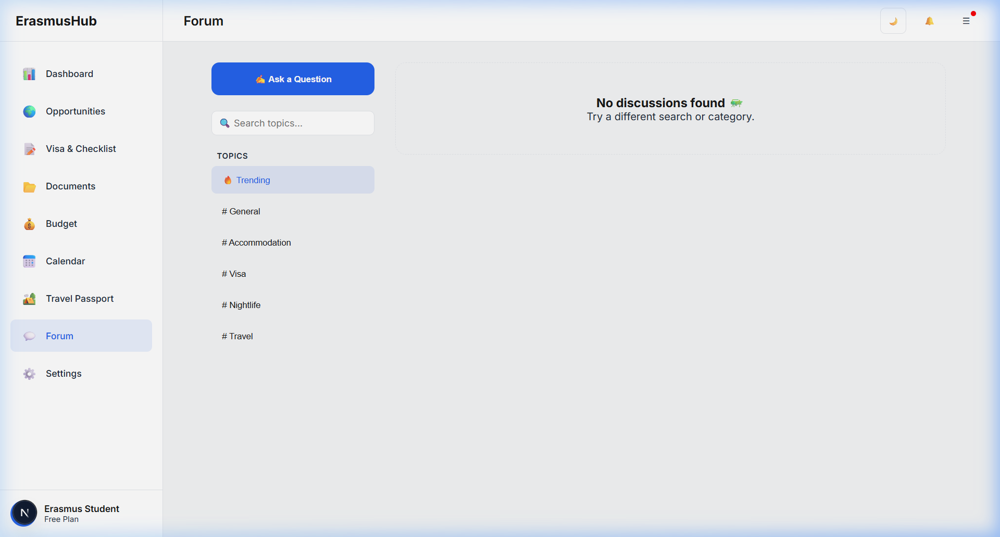
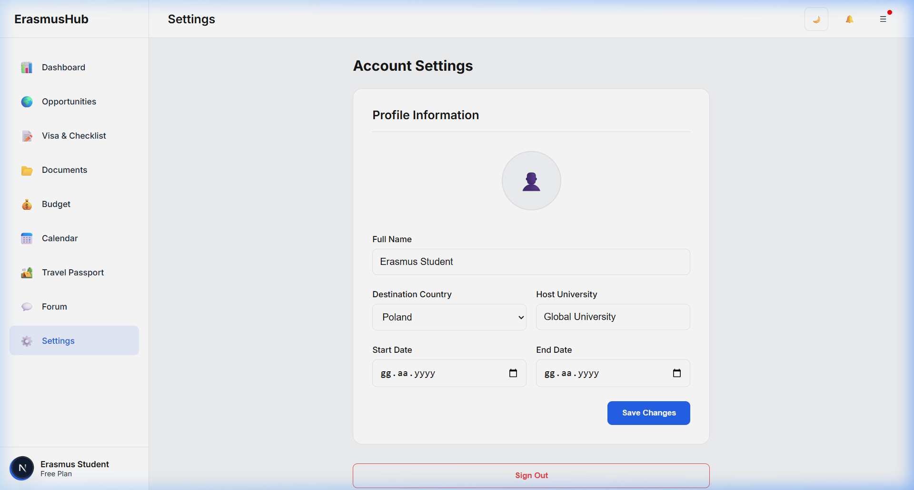

# ErasmusHub 🌍
### Your Ultimate Companion for the Erasmus Journey

ErasmusHub is a modern web application designed to help Erasmus students manage their exchange process from start to finish. It provides tools for visa preparation, budget tracking, and capturing memories in a digital travel passport.

---

## 🚀 Tech Stack

### Frontend
- **Framework**: [Next.js 16](https://nextjs.org/) (App Router)
- **Library**: [React 19](https://react.dev/)
- **Language**: [TypeScript](https://www.typescriptlang.org/)
- **Styling**: Vanilla CSS with [CSS Modules](https://github.com/css-modules/css-modules)
- **Icons**: Text Emojis & Custom SVGs
- **Theming**: [next-themes](https://github.com/pacocoursey/next-themes) (Dark/Light mode support)

### Backend & Database
- **Database**: [SQLite](https://www.sqlite.org/) (Local `erasmus.db`)
- **Backend Logic**: Next.js [API Routes](https://nextjs.org/docs/app/building-your-application/routing/route-handlers)
- **Database Client**: [better-sqlite3](https://github.com/WiseLibs/better-sqlite3)

---

## ✨ Key Features

- **📊 Smart Dashboard**: A centralized view of your journey progress, budget status, and next actions.
- **📝 Visa & Checklist**: Manage country-specific requirements and track every document.
- **💰 Budget Tracker**: Keep track of your Erasmus grant and daily expenses with automatic remaining budget calculation.
- **🛂 Travel Passport**: A digital diary to record the cities and countries you visit during your exchange.
- **🎓 Onboarding**: A step-by-step setup to customize the app for your destination and university.

---

## 📸 Screenshots

### Dashboard


### Opportunities


### Visa Checklist


### Documents


### Budget Tracker


### Calendar


### Forum


### Settings


---

## 🛠️ Getting Started

### Prerequisites
- Node.js (Latest LTS version recommended)
- npm or yarn

### Installation

1. Clone the repository (or navigate to the project folder).
2. Install dependencies:
   ```bash
   npm install
   ```
3. Run the development server:
   ```bash
   npm run dev
   ```
4. Open [http://localhost:3000](http://localhost:3000) in your browser.

### Database Initialization
The application uses a local SQLite database (`erasmus.db`). It will be automatically created and seeded with mock data on the first run.

---

## 📝 Project Structure

- `src/app`: Next.js App Router pages and API routes.
- `src/components`: Reusable UI components (Onboarding, ThemeProvider, etc.).
- `src/lib`: Database initialization (`db.ts`) and utility functions.
- `src/styles`: Global CSS and shared styles.

---

Developed with ❤️ for Erasmus students.
